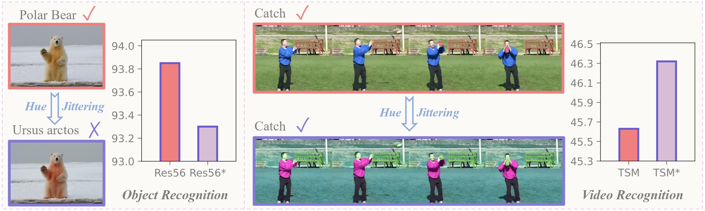
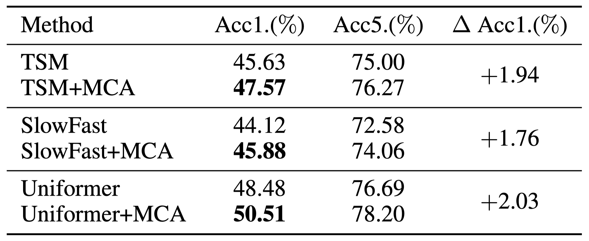
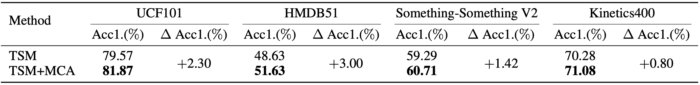
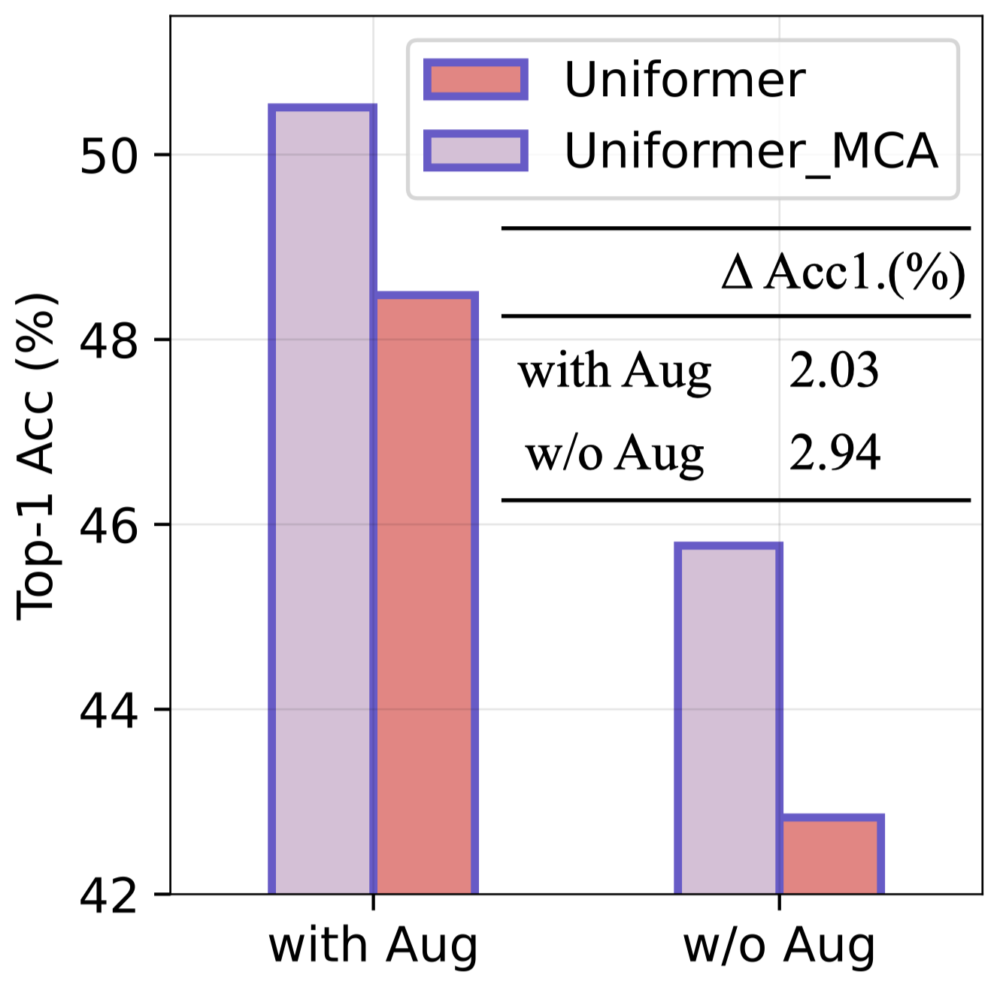
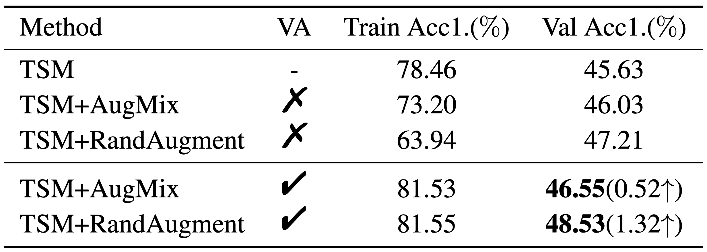

# Don't Judge by the Look: A Motion Coherent Augmentation for Video Recognition (ICLR2024)


<div align="left">
    <a></a>
    <a></a>
</div>

[arXiv](https://arxiv.org/abs/2403.09506) | Primary contact: [Yitian Zhang](mailto:markcheung9248@gmail.com)


<div align="center">
  
</div>

## TL,DR
- `Motivation`: Existing object recognition training protocols involve multiple data augmentation but neglect Hue Jittering, which leads to appearance variation. However, we find its beneficial effect in video recognition since the appearance variation implicitly prioritizes motion information (see Figure above).
- `Challenges`: (1) Inefficient implementation of Hue Jittering (2) Distribution shift caused by Hue Variance.
- `Solution`: We propose Motion Coherent Augmentation (MCA), which is composed of (1) SwapMix: modifies the appearances of video samples efficiently; (2) Variation Alignment: resolves the distribution shift caused by SwapMix.
- `Strength`: (1) Obvious Performance Gain (2) Generalization ability over different architectures and datasets (3) Compatibility with other augmentation methods (4) Application of Variation Alignment in other augmentation methods for even higher performance


## Datasets
Please follow the instruction of [TSM](https://github.com/mit-han-lab/temporal-shift-module#data-preparation) to prepare the Something-Something V1/V2, Kinetics400, HMDB51 datasets.

## Support Models

MCA is a general data augmentation method and can be easily applied to existing methods for stronger performance with a few lines of code:

  ```
  ######  Hyperparameter  ######

  Beta = 1.0
  MCA_Prob = 1.0
  Lambda_AV = 1.0

  ######  SwapMix  ######

  r = np.random.rand(1)
  if r < MCA_Prob:
      # generate co-efficient lambda
      batch_num = inputs.shape[0]
      lam = torch.from_numpy(np.random.beta(Beta, Beta, batch_num)).view(-1,1,1,1,1).cuda()
      # random shuffle channel order
      rand_index = torch.randperm(3).cuda()
      while (rand_index - torch.tensor([0,1,2]).cuda()).abs().sum() == 0:
          rand_index = torch.randperm(3).cuda()
      # interpolation for enlarged input space
      inputs_color = lam * inputs + (1-lam) * inputs[:, rand_index]
      

  ######  Variation Alignment  ######    

  if r < MCA_Prob:
      # construct training pair
      inputs_cat = []
      inputs_cat.append(torch.cat((inputs,inputs_color),0))
      output = model(input_cat)
      loss = criterion(output[:batch_num], target)
      loss_kl = Lambda_AV * nn.KLDivLoss(reduction='batchmean')(nn.LogSoftmax(dim=1)(output[batch_num:]), nn.Softmax(dim=1)(output[:batch_num].detach()))
      loss += loss_kl
  else:
      output = model(inputs)
      loss = criterion(output, target)
  ```
Note that Variation Alignment can be easily extended to resolve the distribution shift of other augmentation methods by replacing `inputs_color` with `inputs_aug`, which are training samples generated by other augmentation operations:
  ```
   inputs_cat.append(torch.cat((inputs,inputs_aug),0))
  ```


Currently, MCA supports the implementation of 2D Network: [TSM](https://arxiv.org/abs/1811.08383); 3D Network: [SlowFast](https://openaccess.thecvf.com/content_ICCV_2019/papers/Feichtenhofer_SlowFast_Networks_for_Video_Recognition_ICCV_2019_paper.pdf); Transformer Network: [Uniformer](https://arxiv.org/abs/2201.09450).

## Result

- Validation Across Architectures

<div align="center">
  
</div>

MCA can obviously outperform the baseline method on different architectures on Something-Something V1 dataset.

Here we provide the pretrained models on all these architectures:
| Model | Acc1. |  Weight  |
| --------------- | --------------- | ------------- |
| TSM  | 45.63% | [link](https://drive.google.com/file/d/19tkDLkTetnOPTf8Rb4vGVKqjvAyKc0Mc/view?usp=sharing) |
| TSM-MCA  | 47.57% | [link](https://drive.google.com/file/d/1dr2x9jTQ28V_Qfg0FJPrvp7yB-cP6DLu/view?usp=sharing) |
||
| SlowFast  | 44.12% | [link](https://drive.google.com/file/d/15YKrKpw5o5L_2Z5sSHUBocTb60HUAM2j/view?usp=sharing) |
| SlowFast-MCA  | 45.88% | [link](https://drive.google.com/file/d/1L8F1oGJYliQOX3q9xQ0PZ4nP3JV1SMFJ/view?usp=sharing) |
||
| Uniformer | 48.48% | [link](https://drive.google.com/file/d/19KAdWIpLGbDa2z7BmbOny1WrDuwTz8Ky/view?usp=sharing) |
| Uniformer-MCA  | 50.51% | [link](https://drive.google.com/file/d/1bDArCCHwF9OT-ifFlgBkfyNlerK8QMNy/view?usp=sharing) |


- Validation Across Datasets

<div align="center">
  
</div>

MCA can obviously outperform the baseline method on different datasets.

Here we provide the pretrained models on Something-Something V2:
| Model | Acc1. | Weight  |
| --------------- | --------------- | ------------- |
| TSM  | 59.29% | [link](https://drive.google.com/file/d/115sSRe_J07nFvg1nL9olMDzDbtdIBjGi/view?usp=sharing) |
| TSM-MCA  | 60.71% | [link](https://drive.google.com/file/d/1JynjO1cOQLGEXYOXV44SeXCD-fBQtgeV/view?usp=sharing) |

and Kinetics400:
| Model | Acc1. | Weight  |
| --------------- | --------------- | ------------- |
| TSM  | 70.28% | [link](https://drive.google.com/file/d/16CC_XrRV5_AV2mr2WKWmSHrZ2z0inT0q/view?usp=sharing) |
| TSM-MCA  | 71.08% | [link](https://drive.google.com/file/d/1CGtpIVyU_MBAuJCeNUSW_x5lYCF5MKhl/view?usp=sharing) |


- Compatibility with other augmentation methods

<div align="center">
  
</div>

- Application of Variation Alignment in other augmentation methods


<div align="center">
  
</div>


## Get Started

We provide a comprehensive codebase for video recognition which contains the implementation of [2D Network](2D_Network/), [3D Network](3D_Network/) and [Transformer Network](Transformer_Network/). Please go to the folders for specific docs.


## Acknowledgment

Our codebase is heavily build upon [TSM](https://github.com/mit-han-lab/temporal-shift-module#data-preparation), [SlowFast](https://github.com/facebookresearch/SlowFast), [Uniformer](https://github.com/Sense-X/UniFormer/tree/main/video_classification) and [FFN](https://github.com/BeSpontaneous/FFN-pytorch). We gratefully thank the authors for their wonderful works. The README file format is heavily based on the GitHub repos of my colleague [Huan Wang](https://github.com/MingSun-Tse), [Xu Ma](https://github.com/ma-xu) and [Yizhou Wang](https://github.com/wyzjack). Great thanks to them! We also greatly thank the anounymous ICLR'24 reviewers for the constructive comments to help us improve the paper.